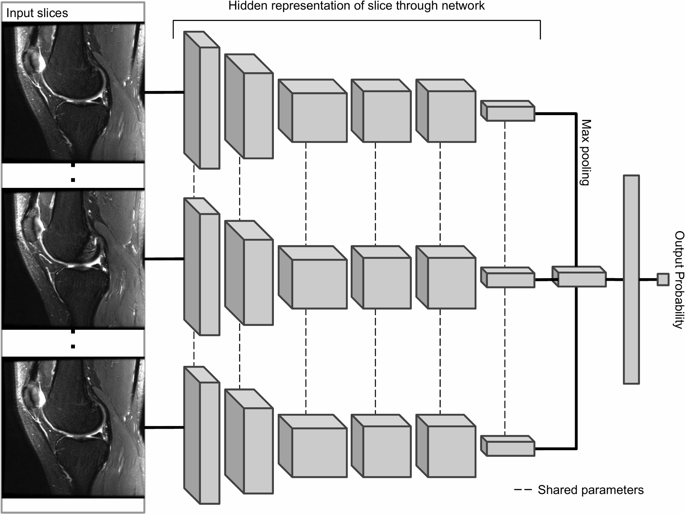

# Deep learning in medical imaging: Detection of knee injuries in MRI Scans

The goal of this project is the implementation of the Stanford MRNet for knee injuries detection described in  <a href="https://journals.plos.org/plosmedicine/article?id=10.1371/journal.pmed.1002699">this research paper</a>

# Dataset

The dataset can be downloaded at  <a href="https://stanfordmlgroup.github.io/competitions/mrnet/">this link</a>.
It contains 1370 knee MRI exams performed at Stanford University Medical Center to study the presence of Anterior Cruciate Ligament (ACL) tears.

# Content

`data_preprocessor.py`: Loads the MRI dataset and applies data augmentation 

`model.py`: Defines the model architecture and methods for training and validation. We use transfer learning by using a pre-trained CNN model

`train.py`: Runs the training of the model

# Model architecture

The model takes as input a series of MRI scans that are passed through a CNN-model to produce a classification prediction. Features of each slice are extracted using an AlexNet and a Max pooling is performed to combine them. It is finally passed to a fully-connected later to output a single probability

